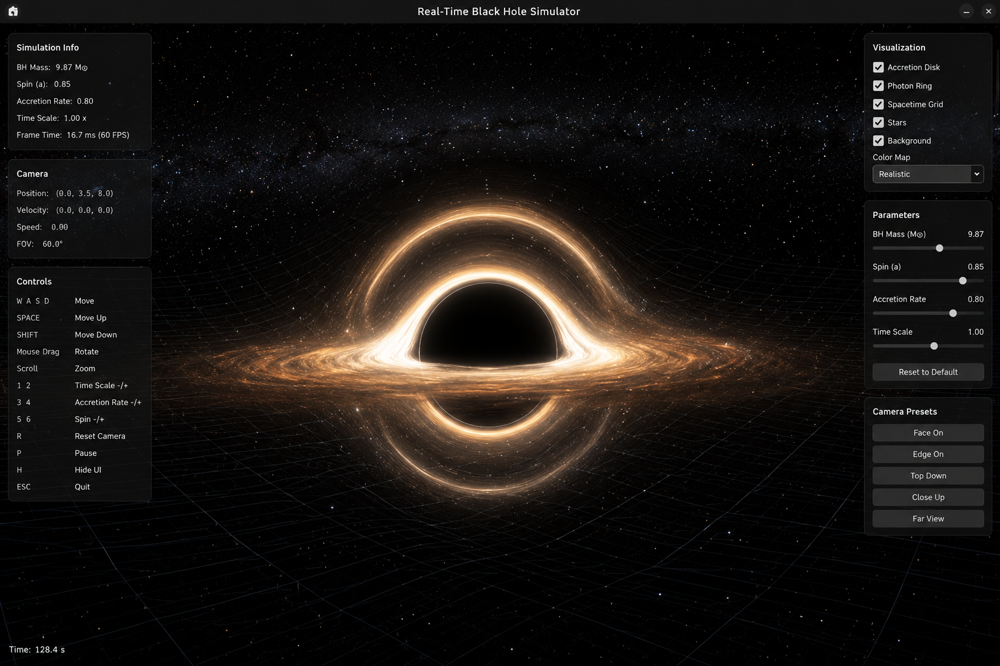

# Black Hole Observational Memory

## Observational Memory Horizons of Black Holes: Quantifying the Recoverability of Event Identity and Event Timing from Synthetic and Realistic Observations

<p align="center">
  
</p>

<p align="center">
  <em>
  Real-time GPU black-hole simulator used to generate synthetic observations for memory persistence experiments.
  </em>
</p>

---

## What if black holes could be remembered?

Modern astronomy can observe the environments surrounding black holes, but can those observations reveal information about events that happened in the past?

This project introduces the concept of **Observational Memory** — the idea that black-hole observations may retain recoverable traces of previous physical events.

Using simulation, machine learning, morphology analysis, temporal observations, and comparisons with realistic astrophysical data, this research investigates:

* What happened?
* When did it happen?
* How long does that information remain observable?

---

## Key Idea

The project treats black-hole observations as **memory-bearing systems**.

Instead of asking:

> How does a black hole look?

this project asks:

> What can a black-hole observation remember?

---

## Main Results

### Event Identity Is Recoverable

Past events leave recognizable signatures that can often be identified from observations.

Examples:

* Accretion bursts
* Jet eruptions
* Turbulence spikes
* Spin transitions

---

### Event Timing Is Much Harder

Determining **when** an event occurred is significantly more difficult than determining **what** happened.

---

### Observation Timing Matters

Observing an event directly dramatically improves recoverability.

The timing of the observation often matters more than increasing model complexity.

---

### Memory Persistence Exists

Information about past events remains observable for finite periods.

The project introduces:

* Memory Persistence
* Memory Half-Life
* Memory Horizons

as quantitative measures of observational memory.

---

# Research Framework

```text
Synthetic Black-Hole Universe
            ↓
Memory Persistence Experiments
            ↓
Event Recoverability Analysis
            ↓
GRMHD-Inspired Morphology Layer
            ↓
Real Observation Consistency Study
```

---

# Project Structure

| Phase          | Description                                                   |
| -------------- | ------------------------------------------------------------- |
| Phase 1–5      | Synthetic black-hole generation and physics-to-image coupling |
| Phase 2–2.2    | Memory-preserving reconstruction models                       |
| Phase 4 Series | Physical parameter recovery                                   |
| Phase 5 Series | Dataset and morphology refinement                             |
| Phase 6        | Static memory persistence                                     |
| Phase 6-T      | Temporal observation study                                    |
| Phase 6-U      | Event-centered observation study                              |
| Phase 7-A      | Real observation consistency analysis                         |
| Phase 7-A.1    | External dataset acquisition                                  |
| Phase 7-A.2    | GRMHD image harvesting                                        |
| Final Audit    | Publication-ready synthesis                                   |

---

# Installation

Clone the repository:

```bash
git clone https://github.com/Malbasahi/Black-Hole-Observational-Memory.git
cd Black-Hole-Observational-Memory
```

Install dependencies:

```bash
pip install -r requirements.txt
```

---

# Quick Start

Launch Jupyter:

```bash
jupyter notebook
```

Recommended execution order:

```text
Phase 5
↓
Phase 2.2
↓
Phase 6
↓
Phase 6-T
↓
Phase 6-U
↓
Final Audit
↓
Phase 7-A.1
↓
Phase 7-A.2
↓
Phase 7-A
```

---

# Scientific Contribution

This project introduces a new framework for studying:

### Observational Memory

The persistence of detectable signatures from past physical events.

### Event Recoverability

The ability to recover information about previous events from current observations.

### Memory Horizons

The maximum timescale over which event information remains recoverable.

Together, these concepts provide a new way to study information persistence in black-hole environments.

---

# Repository Contents

Included:

* Source code
* Simulation framework
* Research notebooks
* Analysis pipelines
* Documentation

Excluded:

* Generated datasets
* Trained checkpoints
* Output artifacts

All results can be reproduced locally.

---

# Technology Stack

* Python
* PyTorch
* NumPy
* SciPy
* Scikit-Learn
* Astropy
* OpenCV
* Scikit-Image
* Jupyter

---

# Project Status

Active Independent Research Project

Current research direction:

**Synthetic → GRMHD → Real Observation Consistency**

---

## Citation

If you use this repository, please cite:

**Marwa Albasahi**

*Observational Memory Horizons of Black Holes: Quantifying the Recoverability of Event Identity and Event Timing from Synthetic and Realistic Observations*
